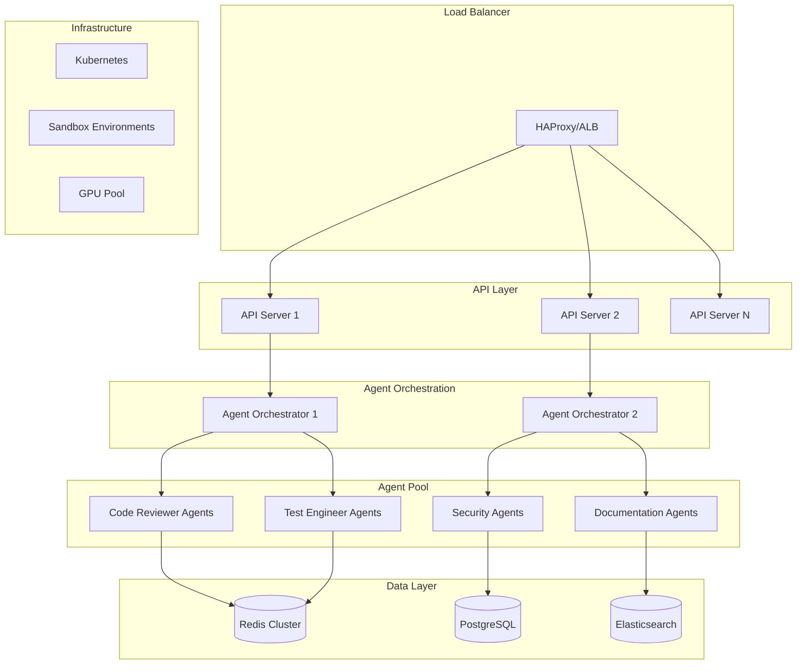
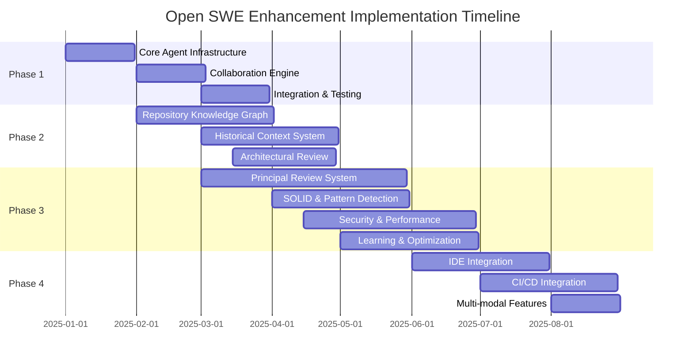

# Open SWE Enhancement Implementation Plan

## Executive Summary

This document outlines the comprehensive implementation plan for enhancing Open SWE, an open-source cloud-based asynchronous coding agent. The plan focuses on transforming Open SWE into a sophisticated multi-agent collaborative development platform while maintaining its core strengths of asynchronous operation, GitHub integration, and human-in-the-loop capabilities.

### Key Objectives
- Implement multi-agent collaboration system leveraging LangGraph
- Enhance developer experience with advanced context understanding
- Build Principal Engineer-level AI code review capabilities with <5% false positive rates
- Enable enterprise-grade integrations and security features
- Achieve 80% developer adoption with 30% review time reduction

### Timeline
- **Total Duration**: 9 months
- **Phase 1**: Multi-Agent Foundation (Months 1-3)
- **Phase 2**: Developer Experience (Months 2-4)
- **Phase 3**: Principal Engineer Code Review & Quality (Months 3-6) - Accelerated
- **Phase 4**: Advanced Integrations (Months 6-9)

---

## Current State Analysis

### Existing Architecture
Open SWE currently employs a sophisticated architecture built on LangGraph:

#### Core Components
- **Manager Graph**: Orchestrates overall workflow and task delegation
- **Planner Graph**: Analyzes tasks and creates implementation plans
- **Programmer Graph**: Executes code changes and implementations
- **Reviewer Graph**: Reviews code changes and provides feedback

#### Current Strengths
1. **Asynchronous Operation**: Cloud-based execution allows parallel task processing
2. **GitHub Integration**: Seamless workflow from issues to pull requests
3. **Human-in-the-Loop**: Interactive planning and execution feedback
4. **Cost Optimization**: Prompt caching reduces AI API costs by up to 90%

### Caching Strategy Analysis

Open SWE implements Anthropic's prompt caching feature:
- **Ephemeral Cache Control**: Applied to conversation contexts
- **Cache Metrics Tracking**: Monitors hit rates and cost savings
- **Cost Reduction**: Cache reads cost 0.1x vs regular tokens

---

## Market Analysis & Strategic Positioning

### 2025 AI Coding Assistant Trends
1. **Multi-Agent Systems**: 60% of AI developers use multi-agent orchestration
2. **Enterprise Adoption**: 75% of enterprise developers will use AI coding assistants by 2028
3. **Asynchronous Workflows**: Market shift toward autonomous, long-running agents

### Competitive Landscape

| Feature | Open SWE | GitHub Copilot | SWE-agent | OpenHands |
|---------|----------|----------------|-----------|-----------|
| Asynchronous Operation | ✅ | ❌ | ❌ | ❌ |
| Multi-Agent Support | Planned | ❌ | ❌ | ❌ |
| GitHub Workflow Integration | ✅ | Partial | ❌ | ❌ |
| Human-in-the-Loop | ✅ | ❌ | ❌ | Partial |
| Open Source | ✅ | ❌ | ✅ | ✅ |

### Strategic Positioning
> "The only asynchronous, enterprise-ready AI coding agent with Principal Engineer-level code review intelligence and native GitHub workflow integration"

---

## Enhancement Plan Overview

### Priority Tiers

#### Tier 1 - Immediate (0-6 months)
1. **Multi-Agent Collaboration**
   - Market demand: HIGH
   - Technical feasibility: HIGH
   - Competitive advantage: CRITICAL

2. **Developer Experience Improvements**
   - Implementation complexity: MEDIUM
   - User impact: HIGH
   - Resource requirements: MODERATE

#### Tier 2 - Medium Term (6-12 months)
3. **Principal Engineer Code Review System**
   - Enterprise value: VERY HIGH
   - Technical complexity: HIGH
   - Revenue potential: VERY HIGH
   - Competitive differentiation: UNIQUE

4. **Advanced Integration Capabilities**
   - Market requirement: ESSENTIAL
   - Partnership dependencies: HIGH
   - Differentiation potential: MEDIUM

#### Tier 3 - Long Term (12-18 months)
5. **Enterprise & Security Features**
   - Market segment: Enterprise
   - Implementation complexity: HIGH
   - Revenue impact: VERY HIGH

6. **Performance & Scalability Enhancements**
   - Operational necessity: HIGH
   - User visibility: LOW
   - Technical debt reduction: HIGH

---

## Technical Implementation Plan

### Phase 1: Multi-Agent Foundation (Months 1-3)

#### System Architecture

```typescript
// Core agent system extension
export interface AgentProfile {
  role: 'code_reviewer' | 'test_engineer' | 'documentation' | 'security' | 'architect'
        | 'code_smell_detector' | 'bug_pattern_analyzer' | 'performance_optimizer'
        | 'architectural_reviewer' | 'solid_principles_validator';
  specialization: string[];
  tools: string[];
  collaborationRules: CollaborationRule[];
  reviewThresholds?: ReviewThresholds;
}

export interface ReviewThresholds {
  falsePositiveRate: number; // Target: <5%
  responseTime: number; // Target: <30s standard, <5min complex
  coverageRequirements: {
    unit: number; // 80-90%
    critical: number; // 95%
  };
  complexityLimits: {
    method: number; // <10 cyclomatic
    class: number; // <50 total
  };
}

export interface MultiAgentState extends GraphState {
  activeAgents: Map<string, AgentProfile>;
  collaborationContext: SharedContext;
  taskDelegations: TaskDelegation[];
}
```

#### Month 1: Core Infrastructure
**Deliverables:**
- Extended GraphState supporting multi-agent orchestration
- Agent Registry with capability discovery
- Basic inter-agent communication protocol

**Key Components:**
```typescript
// Agent Registry
class AgentRegistry {
  registerAgent(profile: AgentProfile): void;
  discoverAgents(capability: string): AgentProfile[];
  getAgentStatus(agentId: string): AgentStatus;
}

// Communication Hub
class AgentCommunicationHub {
  sendMessage(from: string, to: string, message: AgentMessage): void;
  broadcastToRole(role: AgentRole, message: AgentMessage): void;
  subscribeToEvents(agentId: string, eventType: string): Observable<AgentEvent>;
}
```

#### Month 2: Collaboration Engine
**Deliverables:**
- Task delegation system with intelligent routing
- Shared context store with role-based access
- Coordination patterns for parallel execution

**Implementation Details:**
- Event-driven architecture for agent collaboration
- Conflict resolution mechanisms for concurrent modifications
- Transaction-like guarantees for multi-agent operations

#### Month 3: Integration & Testing
**Deliverables:**
- Integration with existing Programmer and Reviewer graphs
- Comprehensive test suite for multi-agent scenarios
- Performance benchmarks and optimization

### Phase 2: Enhanced Developer Experience (Months 2-4)

#### Repository Knowledge Graph
**Architecture:**
```typescript
interface CodeEntity {
  id: string;
  type: 'class' | 'function' | 'module' | 'variable';
  relationships: Relationship[];
  semanticEmbedding: number[];
  metadata: EntityMetadata;
}

class RepositoryKnowledgeGraph {
  addEntity(entity: CodeEntity): void;
  findRelated(entityId: string, depth: number): CodeEntity[];
  semanticSearch(query: string): CodeEntity[];
  updateOnChange(change: CodeChange): void;
}
```

**Features:**
- Semantic code analysis and relationship mapping
- Incremental updates on code changes
- Query interface for agent decision-making

#### Historical Context System
**Components:**
- Context persistence layer with versioning
- Relevance scoring algorithm
- Session carryover mechanism

#### Architectural Review Capabilities
```typescript
interface ArchitecturalReviewCapabilities {
  // Microservices patterns
  detectServiceBoundaries(): ServiceBoundaryAnalysis;
  identifyAntiPatterns(): AntiPattern[]; // distributed monolith, chatty APIs
  validateResiliencePatterns(): ResilienceValidation; // circuit breakers, saga
  
  // Database optimization
  analyzeQueryPerformance(): QueryAnalysis; // <100ms target
  validateIndexStrategy(): IndexEfficiency; // >95% hit ratio
  
  // Caching patterns
  validateCacheStrategy(): CacheAnalysis; // >90% hit ratio
  detectCacheInvalidationIssues(): CacheIssue[];
}
```

### Phase 3: Principal Engineer Code Review & Quality (Months 3-6)

#### Multi-Agent Review System
**Specialized Agents:**
- **Code Review Agent**: Overall structure and standards analysis
- **Bug Pattern Analyzer**: Pattern recognition using historical fixes (25% match rate target)
- **Code Smell Detector**: Anti-pattern identification with <5% false positives
- **Performance Optimizer**: Bottleneck detection and optimization suggestions
- **Security Scanner**: OWASP Top 10 vulnerability detection
- **Architectural Reviewer**: DDD boundaries, microservice patterns, resilience validation

#### Advanced Review Capabilities
**Performance Metrics:**
- Database query optimization: <100ms for simple queries
- Index hit ratios: >95% for OLTP systems
- Cache hit ratios: >90% target
- API response times: <100ms standard endpoints

**Security Thresholds:**
- Maximum 5 failed login attempts before lockout
- Session timeouts: <30 minutes for sensitive applications
- Password complexity: 8+ characters, mixed case/numbers/symbols
- JWT token validation and OAuth 2.0 compliance

**Code Quality Metrics:**
- Technical debt ratio: <5%
- Maintainability index: >65 (Microsoft formula)
- Code coverage: 80-90% unit tests, 95% critical logic
- Cyclomatic complexity: <10 methods, <50 classes
- Code duplication: <3%

#### SOLID Principles Validation
**Automated Detection:**
- Single Responsibility: Classes <5 public methods, <200 lines
- Open/Closed: Extension point analysis
- Liskov Substitution: Contract violation detection
- Interface Segregation: Interface cohesion metrics
- Dependency Inversion: Abstraction layer validation

#### Design Pattern Recognition
**Capabilities:**
- Common patterns: Factory, Strategy, Observer, Repository
- Anti-patterns: God class, spaghetti code, distributed monolith
- Architectural patterns: MVC, hexagonal, event-driven validation

#### Learning from Production
**Case Study Implementations:**
- **Uber's Piranha**: Automated stale code cleanup
- **Google's Tricorder**: Microservices-based analysis at scale
- **Facebook's Getafix**: Hierarchical clustering for pattern mining
- **Microsoft's IntelliCode**: Context-aware suggestions

### Phase 4: Advanced Integrations (Months 6-9)

#### IDE Integration
**Scope:**
- VS Code extension with real-time collaboration
- JetBrains plugin support
- Language Server Protocol implementation

#### CI/CD Pipeline Integration
**Features:**
- GitHub Actions custom actions
- Jenkins plugin
- GitLab CI/CD integration

#### Multi-Modal Capabilities
**Components:**
- Image/diagram analysis for documentation
- Voice command interface
- Visual code generation from mockups

---

## Infrastructure & Scalability

### Architecture Overview



### Scalability Strategy

#### Horizontal Scaling
- **Agent Pool Management**: Dynamic scaling based on workload
- **Load Distribution**: Intelligent routing using consistent hashing
- **Resource Optimization**: Container orchestration with Kubernetes

#### Performance Optimization
- **Multi-Level Caching**: Prompt, context, and knowledge graph caching
- **Predictive Scaling**: ML-based resource prediction
- **Edge Computing**: Distributed execution for global performance

### Security Architecture

#### Security Layers
1. **Network Security**: VPC isolation, TLS 1.3 encryption
2. **Application Security**: OAuth 2.0, JWT tokens, rate limiting
3. **Data Security**: Encryption at rest, key rotation
4. **Audit & Compliance**: Comprehensive logging, SIEM integration

#### Compliance Framework
- **SOC 2 Type II**: Automated compliance monitoring
- **GDPR**: Data privacy controls and user consent
- **ISO 27001**: Information security management

---

## Development Process & Team Structure

### Recommended Team Organization

#### Core Teams
1. **Agent Platform Team** (4 engineers)
   - LangGraph expertise
   - Distributed systems experience
   - Focus: Multi-agent infrastructure

2. **Code Review Intelligence Team** (4 engineers)
   - ML/AI background
   - Static analysis expertise
   - Security analysis experience
   - Focus: Principal Engineer-level review patterns

3. **Integration Team** (3 engineers)
   - API design expertise
   - Third-party integration experience
   - Focus: External connections

4. **DevOps/Infrastructure** (2 engineers)
   - Kubernetes expertise
   - Monitoring and observability
   - Focus: Scalability and reliability

5. **Quality & Performance Team** (2 engineers)
   - Performance optimization
   - Testing frameworks
   - Focus: Review accuracy and speed

### Development Methodology

#### Agile Adaptation for AI
- **2-Week Sprints**: Rapid iteration with continuous deployment
- **AI Testing Framework**: Behavior validation for agent actions
- **A/B Testing**: Systematic improvement validation

#### Quality Assurance
- **Multi-Agent Testing**: Specialized test scenarios
- **Chaos Engineering**: Resilience testing
- **Security Testing**: Continuous vulnerability scanning

---

## Risk Analysis & Mitigation

### Technical Risks

| Risk | Probability | Impact | Mitigation Strategy |
|------|-------------|---------|-------------------|
| Agent Coordination Complexity | HIGH | HIGH | Circuit breakers, fallback mechanisms |
| Performance Degradation | MEDIUM | HIGH | Auto-scaling, performance monitoring |
| Data Consistency Issues | MEDIUM | MEDIUM | Event sourcing, SAGA patterns |
| Third-party API Changes | MEDIUM | MEDIUM | Adapter pattern, version management |

### Business Risks

| Risk | Probability | Impact | Mitigation Strategy |
|------|-------------|---------|-------------------|
| Slow User Adoption | MEDIUM | HIGH | Gradual rollout, extensive documentation |
| Competitive Features | HIGH | MEDIUM | Rapid iteration, unique positioning |
| Resource Constraints | MEDIUM | MEDIUM | Phased hiring, outsourcing options |
| Cost Overruns | LOW | HIGH | Strict budget monitoring, cloud cost optimization |

---

## Success Metrics & KPIs

### Product Metrics
- **Agent Collaboration Efficiency**: Task completion time improvement
- **Code Quality Score**: Bug reduction, security vulnerability decrease
- **Developer Productivity**: Features delivered per sprint
- **System Reliability**: 99.9% uptime target

### Code Review Metrics
- **Review Performance**: <30s standard reviews, <5min complex reviews
- **False Positive Rate**: <5% target
- **Developer Adoption**: >80% within 6 months
- **Fix Suggestion Accuracy**: >25% exact match with human fixes
- **Security Detection**: 100% OWASP compliance
- **Technical Debt Tracking**: Maintain <5% ratio

### Business Metrics
- **User Growth**: Monthly active users, retention rate
- **Revenue**: ARR growth, customer lifetime value
- **Market Share**: Percentage in target segments
- **Customer Satisfaction**: NPS score, support ticket volume

### Technical Metrics
- **Performance**: P95 response time < 200ms
- **Scalability**: Support for 10,000 concurrent users
- **Cost Efficiency**: Cost per user < $5/month
- **Security**: Zero critical vulnerabilities

---

## Implementation Timeline




## Conclusion

This implementation plan provides a structured approach to evolving Open SWE into a market-leading multi-agent collaborative development platform. The phased approach balances technical innovation with business viability, ensuring sustainable growth while maintaining the reliability and extensibility that users expect.

### Next Steps
1. **Approve budget and timeline**
2. **Begin team recruitment**
3. **Set up development infrastructure**
4. **Initiate Phase 1 development**
5. **Establish partnerships for integrations**

---

## Appendices

### A. Technical Specifications
[Detailed API specifications, data models, and architecture diagrams]

### B. Market Research Data
[Comprehensive competitive analysis and market sizing]

### C. Risk Register
[Complete risk assessment with mitigation plans]

### D. Glossary
[Technical terms and acronyms used in this document]
